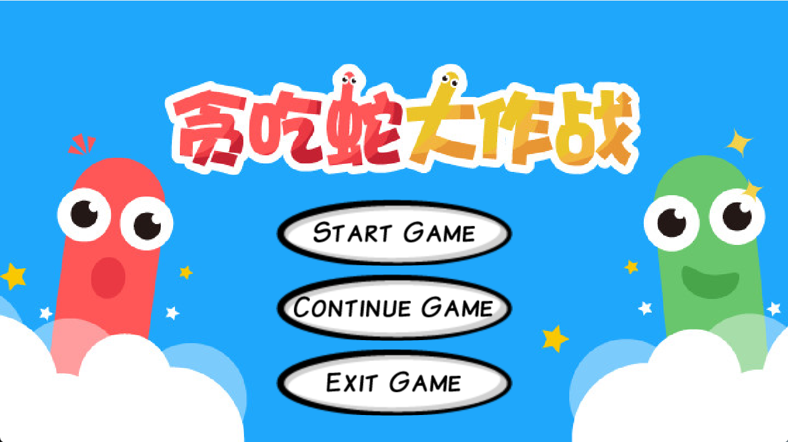

# 贪吃蛇大作战

> `游戏简介`：通过方向键控制你的蛇，吞噬地图上的食物，迅速成长变得更大更强。然而，要小心其他玩家和地图上的陷阱，它们可能对你构成威胁。

## 并发

+ 使用`A*`算法用来作为敌人蛇的寻路`AI`，并为每个敌人蛇自建了全局视野，防止离谱操作造成自身死亡，降低游戏难度和玩家趣味性
+ 使用了多线程变成 ，并发地处理全局玩家（普通玩家和AI玩家）的操作和逻辑更新（包括移动，状态更新等）
+ [并发游戏界面](https://www.bilibili.com/video/BV1pu4y1T7Ue/?spm_id_from=333.999.0.0&vd_source=a2dbff0147d2cc6deb6ea7425b2da261)

## 构建

+ 使用`Maven`管理项目依赖
+ 使用`Maven`构建项目,并使用github action自动化构建

## 测试

+ 使用`Junit`进行单元测试,并使用github action自动化构建,测试覆盖率达到`54%`

## IO

+ 使用`LibGdx`游戏库的``Json序列化``完成对`地图`和`游戏进度`的保存和加载
+ 游戏过程录制和回放暂未完成
+ [IO游戏界面](https://www.bilibili.com/video/BV1T64y1H72U/?spm_id_from=trigger_reload&vd_source=a2dbff0147d2cc6deb6ea7425b2da261)

## 网络开发

+ 暂未完成